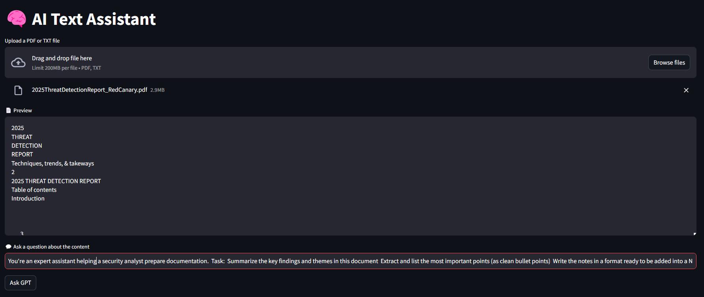
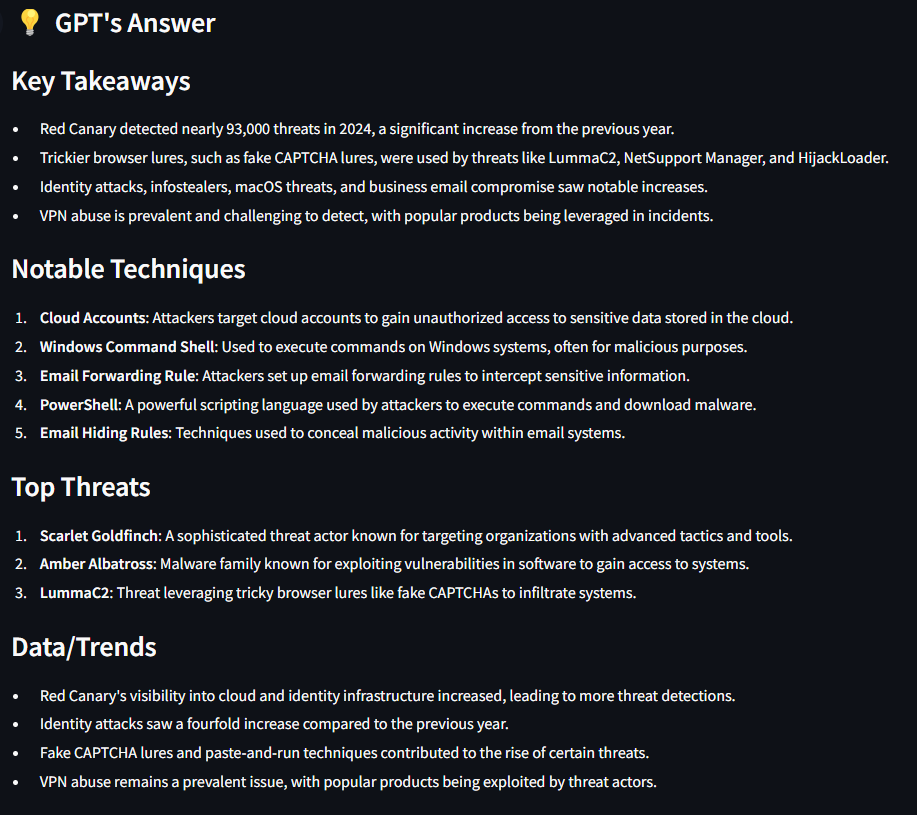

# 📄🤖 PDF-GPT

**PDF-GPT** is an AI-powered assistant that lets you upload a PDF, ask questions about it.

Built with **Streamlit**, **OpenAI**, and **tiktoken**.

---

## 🚀 Features

- 🧠 Ask questions about your PDF content
- 📚 Summarizes long documents intelligently
- 🧩 Handles long files via chunking + embedding
- 🧾 Simple interface built with Streamlit

---

## 📸 Preview

<table>
  <tr>
    <td></td>
    <td></td>
  </tr>
</table>

---

